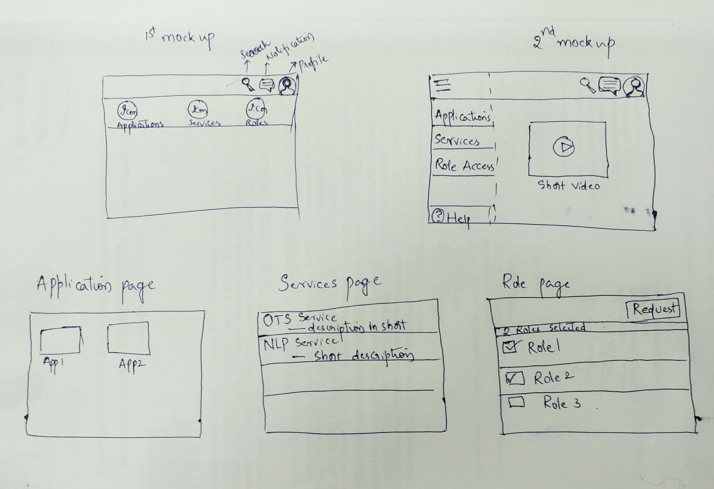

User Home Page

      User Home Page is a mockup UI, with 5 different elements : 
      Applications - User Applications
      Services - Services consumed by the user
      Role Management - Requesting for Role authorization
      User Profile - User details
      Message Notification - Notifying necessary action items that user needs to know.

Design thought process

    Things need to be considered while designing a mock up
    1. Know the requirements 
    2. Categories the elements which are needed but not necessary
    3. How flexible the design is to incorporate some new requirements.
    
    
      
      
      
